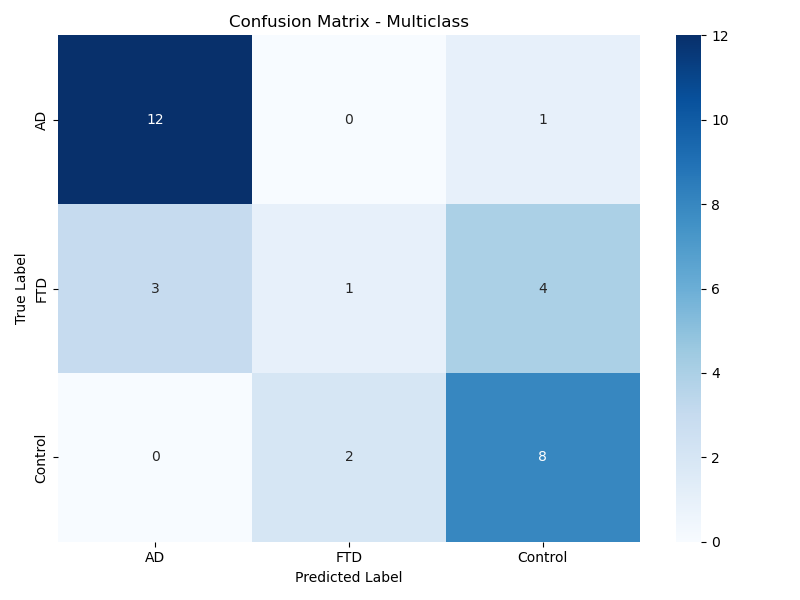
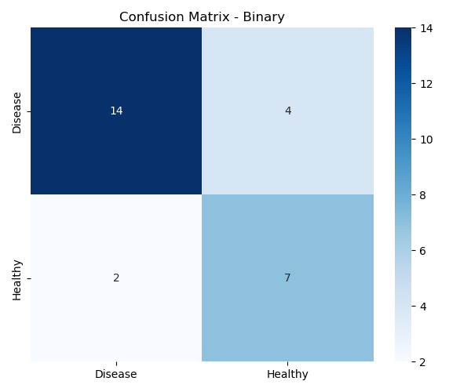

# Classificação avançada da doença de Alzheimer e da demência frontotemporal baseada em EEG

## Visão geral do projeto

Este projeto amplia o trabalho fundamental de Miltiadous et al. (2023) ao desenvolver classificadores avançados de aprendizado de máquina para distinguir entre Doença de Alzheimer (DA), Demência Frontotemporal (DFT) e controles saudáveis ​​usando dados de EEG. O estudo implementa técnicas abrangentes de engenharia de recursos, tratamento de desequilíbrio de classes e validação rigorosa que revelam tanto o potencial quanto as limitações fundamentais das abordagens atuais baseadas em EEG.

## Dataset

**Fonte**: Miltiadous et al. (2023) EEG dataset from OpenNeuro (ds004504)
- **Participantes**: 88 subjects (36 AD, 23 FTD, 29 controls)
- **Registro**: 19-channel resting-state EEG, eyes-closed condition
- **Formato**: BIDS-compliant preprocessed data

### Baixando o Dataset

```bash
# Install OpenNeuro CLI
npm install -g @openneuro/cli

# Login to OpenNeuro
openneuro login

# Download dataset
openneuro download --snapshot 1.0.7 ds004504 ds004504-download/
```

## Principais Contribuições

- **Engenharia de Recursos Avançada**: Ampliação das características espectrais básicas para incluir medidas de conectividade e assimetria hemisférica
- **Avaliação Sistemática de Reamostragem**: Teste de 7 técnicas diferentes para lidar com o desequilíbrio de classes
- **Validação Rigorosa**: Validação cruzada conservadora com abordagem k-fold estratificada
- **Integração com MLflow**: Rastreamento abrangente de experimentos para reprodutibilidade
- **Documentação de Limitações**: Quantificação dos desafios fundamentais na classificação de demência em múltiplas classes
- **Abordagem de Classificação Binária**: Desenvolvimento de um modelo de triagem clinicamente orientado para identificar indivíduos doentes versus saudáveis

## Resultados

### Classificação Multiclasse (DA vs. DFT vs. Controles)
- **Acurácia da Validação Cruzada**: 65,2% ± 8,4%
- **Acurácia do Teste**: 67,7%
- **Generalização**: Boa (diferença de 2,6% entre a validação cruzada e o teste)
- **Detecção de DFT**: 12,5% de recall (limitação crítica)
- **Conclusão**: Clinicamente inadequado devido à baixa discriminação de DFT, apesar da boa generalização

| Métrica | Alzheimer | Frontotemporal | Controle |
|--------|-------------|----------------|---------|
| Precisão | 0,80 | 0,33 | 0,62 |
| Revocação | 0,92 | 0,12 | 0,80 |
| Pontuação F1 | 0,86 | 0,18 | 0,70 |



**Principal Conclusão**: O modelo multiclasse generaliza bem, mas apresenta acurácia fundamentalmente insuficiente para uso clínico. A matriz de confusão revela a falha crítica do modelo na detecção da DFT (Demência Frontotemporal), com a maioria dos casos de DFT classificados erroneamente como Alzheimer ou controles.

### Classificação Binária (Doença vs. Saudável)
- **Acurácia da Validação Cruzada**: 74,6% ± 9,0%
- **Acurácia do Teste**: 77,8%
- **Generalização**: Excelente (diferença de 3,1%)
- **Sensibilidade**: 77,8% (detecção da doença)
- **Especificidade**: 77,8% (identificação de indivíduos saudáveis)

| Métrica | Doença | Saudável |
|--------|---------|---------|
| Precisão | 0,88 | 0,64 |
| Revocação | 0,78 | 0,78 |
| Pontuação F1 | 0,82 | 0,70 |



O classificador binário apresenta desempenho equilibrado em ambas as classes, tornando-o adequado para aplicações de triagem preliminar.

## Comparação de Desempenho

| Estudo | Classificação | Método | Precisão da Validação Cruzada | Generalização |
|-------|---------------|--------|-------------|----------------|
| Miltiadous et al. (2023) | DA vs. Controles | RBP + Florestas Aleatórias | 77,0% | Não relatado |
| Miltiadous et al. (2023) | DFT vs. Controles | RBP + MLP | 73,1% | Não relatado |
| **Este Estudo** | **DA vs. DFT vs. Controles** | **Recursos Aprimorados + XGBoost** | **65,2%** | **Bom (diferença de 2,6%)** |
| **Este Estudo** | **Doença vs. Controles** | **Recursos Aprimorados + XGBoost** | **74,6%** | **Excelente (diferença de 3,1%)** |

## Principais Descobertas

- **Limitação multiclasse**: A baixa detecção de DFT (recall de 12,5%) demonstra limitações fundamentais do EEG em repouso para a discriminação de tipos de demência.
- **Potencial para triagem binária**: A acurácia de 74,6% na validação cruzada com excelente generalização mostra potencial para a detecção preliminar da doença.
- **Análise de reamostragem**: O modelo original (sem reamostragem) apresentou o melhor desempenho para multiclasse; o SMOTE foi o mais adequado para classificação binária.
- **Impacto da engenharia de recursos**: O modelo binário se beneficiou da redução de 31 recursos projetados para 25 recursos selecionados.
- **Boa generalização**: Ambos os modelos apresentam forte generalização (< 3,2% de discrepâncias), indicando regularização adequada.

## Implicações Clínicas

A abordagem de classificação binária demonstra potencial moderado para triagem preliminar com generalização robusta. A falha do modelo multiclasse em distinguir os tipos de demência (particularmente DFT) representa um resultado negativo importante: a limitação não reside na arquitetura do modelo ou no sobreajuste, mas sim no desafio fundamental de utilizar apenas o EEG em repouso para a classificação de subtipos de demência.

## Rastreamento de Experimentos com MLflow

Este projeto utiliza o MLflow para um rastreamento completo de experimentos:
```bash
# Launch MLflow UI
mlflow ui
```

## Estrutura de Arquivos

```
├── analyze.ipynb                 # Main analysis notebook with MLflow integration
├── data/
│   ├── participants.tsv         # Subject demographics
│   ├── extracted_features.csv   # Engineered features
│   └── performance_comparison.csv
├── train_test_splits/           # Data splits
├── mlruns/                      # MLflow tracking data
├── models/                      # Trained models
│   ├── multiclass_xgb_model_20250929.pkl
│   └── binary_xgb_model_20250929.pkl
└── README.md
```

## Requisitos 

- Python 3.8+
- MNE-Python
- XGBoost
- scikit-learn
- imbalanced-learn
- mlflow
- pandas, numpy, matplotlib, seaborn

## Citações
Built upon the dataset from:
Miltiadous, A., et al. (2023). A Dataset of Scalp EEG Recordings of Alzheimer's Disease, Frontotemporal Dementia and Healthy Subjects from Routine EEG. *Data*, 8(6), 95.

